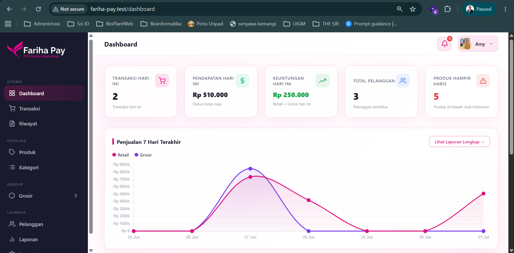
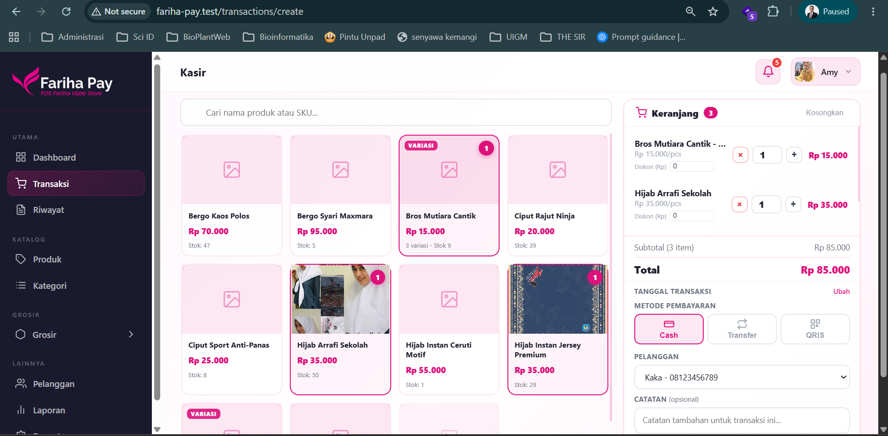
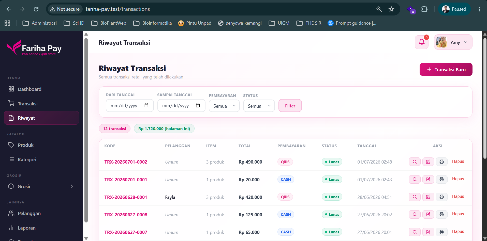
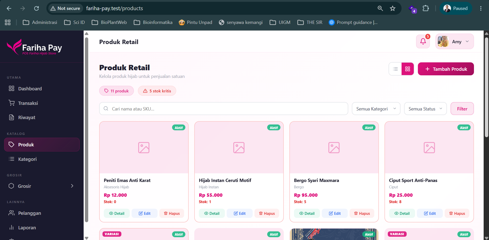
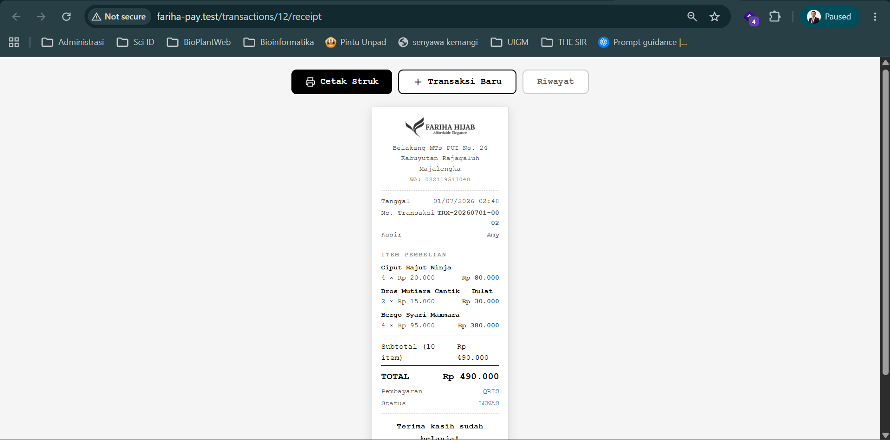

# Fariha Pay — POS Cashier App

> Aplikasi kasir sederhana untuk bisnis retail hijab dan bisnis kecil lainnya yang relevan

Aplikasi point-of-sale berbasis web yang dirancang untuk kebutuhan toko hijab skala kecil-menengah. Mengelola transaksi retail dan grosir secara terpisah, lengkap dengan pengiriman struk via WhatsApp. Dibangun dengan Laravel dan tema *liquid glass* beridentitas warna brand Fariha Hijab.

---

## Preview

---

## Fitur Utama

- **Dua mode transaksi** — retail dan grosir dengan katalog, satuan, dan harga yang sepenuhnya terpisah
- **Manajemen produk** — CRUD katalog produk beserta foto untuk masing-masing mode
- **Kalkulasi otomatis** — total harga dihitung real-time saat input item transaksi
- **Struk via WhatsApp** — struk dikirim langsung ke nomor pelanggan dalam format PDF, sekaligus membangun database nomor pelanggan untuk keperluan promosi
- **Riwayat transaksi** — histori transaksi retail dan grosir tercatat terpisah
- **2 akun pengguna** — akses terbatas sesuai kebutuhan operasional toko

---

## Status Proyek

**MVP** — dikembangkan untuk kebutuhan operasional internal Fariha Hijab, dirancang untuk berjalan di satu PC kasir (localhost).

---

## Tertarik untuk Berkolaborasi atau Mengkustomisasi?

Hubungi saya melalui email: **fawwazmf24@gmail.com**
